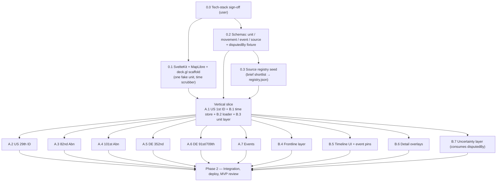

# MVP Execution Plan

> Refined plan for delivering the MVP slice defined in `brief.md`.
> `brief.md` remains the source of truth for scope and success criteria;
> this file is the executable decomposition.

## Context

Session 1 produced `brief.md`, `CLAUDE.md`, and `progress.md`. There is
no code yet and no tech-stack sign-off. An earlier draft execution plan
decomposed the MVP into phases and parallel streams, but it (a) treated
the tech stack as already locked, which `CLAUDE.md` forbids until the
user signs off, (b) launched six dataset tasks in parallel against a
schema that hadn't yet been pressure-tested by the renderer, and
(c) mixed the painted basemap (an explicit risk in `brief.md`) into
MVP integration.

This document is the refined plan. Coding work (scaffold, schemas,
data, layers) is broken into discrete future tasks — each its own
branch / PR — and starts only after the tech-stack gate clears.

## What changes vs. the draft

- **Tech stack: gate, not lock.** Renderer / tile format / app shell /
  hosting are *proposed* per `brief.md` and explicitly require user
  sign-off. The plan adds a Phase 0.0 sign-off gate before any
  scaffolding.
- **Vertical slice before fan-out.** The draft ran Stream A (six
  dataset tasks) parallel to Stream B (seven render tasks). That bakes
  in schema churn risk: dataset authors will hit schema gaps the
  renderer hasn't yet exercised. Refined plan walks **one** unit
  (US 1st ID) end-to-end through the renderer first, then fans out.
- **Source registry is Phase 0.** A.8 in the draft already said
  "run first within Stream A" — promote it. The registry seeds are
  ~7 entries from the brief shortlist and unblocks every dataset task.
- **Contested-fact handling is a schema feature, not just a layer.**
  Schemas in 0.2 model `disputedBy: SourceID[]` (or equivalent) and
  one fixture must exercise it. Stream B's uncertainty layer consumes
  it; it is not invented at the layer.
- **Painted basemap leaves MVP.** `brief.md` flags it as a risk and
  defers it. MVP ships on a placeholder MapLibre style; painted
  basemap moves to a post-MVP roadmap item. This avoids cramming a
  half-project risk into integration.
- **Performance targets become qualitative.** Brief asks for "smooth"
  scrub / pan / zoom; hard `<3 s TTI / ≥30 fps` numbers are useful but
  not gating. Promote them in v1 once we have a real basemap.

## Dependency shape



## Repo layout (target)

```
apps/web/                       # SvelteKit app (Phase 0.1+)
packages/data/schema/           # TS types + JSON Schema (Phase 0.2)
data/units/                     # per-formation tracks (Stream A)
data/events/d-day.json          # event list (A.7)
data/sources/registry.json      # central source registry (Phase 0.3)
mvp-execution-plan.md           # this plan
```

Workspaces: pnpm. Test/validation: `vitest` + `ajv` (schema) — fixed in
0.1 so all later tasks share tooling.

## Phase 0 — Foundation (sequential, blocking)

### 0.0 Tech-stack sign-off — **user gate**

Per `CLAUDE.md`, the renderer / tile format / app shell / hosting
choices need explicit sign-off. Proposed (from brief): MapLibre GL JS
+ deck.gl, Protomaps `.pmtiles`, SvelteKit + TypeScript, pnpm
workspaces, vitest + ajv. Hosting deferred to post-MVP (see Phase 2 /
Out of MVP). Record decision in `progress.md` log. **Blocks 0.1.**

### 0.1 Scaffold + tech validation

- SvelteKit app under `apps/web/` with MapLibre placeholder basemap
  (open demo style), one deck.gl layer interpolating a fake unit
  between two coordinates by simulation time, play/pause/scrub
  timeline. pnpm workspace at repo root.
- **Verify:** `pnpm dev` → scrub timeline → fake unit moves smoothly,
  no jank in dev. Lighthouse / fps not gated yet.
- **Branch:** `claude/tech-validate-<id>`.
- **Blocks:** the vertical slice and all Stream B tasks.

### 0.2 Data schemas

- `packages/data/schema/{unit,movement,event,source}.ts` + matching
  `*.schema.json`. Each record carries `sources: SourceID[]`;
  schema models `disputedBy: SourceID[]` (or equivalent) so
  conflicts are first-class, never silently picked.
- Fixtures: one valid per type, one invalid per type, **one valid
  fixture exercising `disputedBy`** so the contested-fact path is
  proven before any layer consumes it.
- **Verify:** `vitest` + `ajv` — valid pass, invalid reject with
  clear errors.
- **Branch:** `claude/data-schemas-<id>`.
- **Blocks:** 0.3 and the vertical slice.

### 0.3 Source registry seed

- `data/sources/registry.json` populated from the `brief.md` shortlist
  (~7 sources). Append-only thereafter; conflicts resolved by ID.
- **Verify:** validates against `source.schema.json`.
- **Branch:** `claude/source-registry-<id>`.

## Phase 1 — Vertical slice, then fan-out

### 1.V — Vertical slice (sequential, one PR or tightly chained PRs)

Drives schema and renderer through one real unit before any fan-out.

- **A.1** US 1st ID — Omaha track → `data/units/us-1st-id.json`.
  Cite from registry; include at least one disputed fact (e.g. landing
  craft H-hour assignment) using `disputedBy`.
- **B.1** time store + simulation clock → `apps/web/src/lib/time-store.*`
- **B.2** data loader (reads `data/`, validates against schema) →
  `apps/web/src/lib/data-loader.*`
- **B.3** deck.gl unit layer (NATO-style, allied/axis hue family) →
  `apps/web/src/lib/layers/units.*`
- **Verify:** US 1st ID renders and animates over the MVP window from
  real cited data. Schema gaps surfaced here are fixed before fan-out.

### 1.A — Dataset fan-out (parallel, one branch/PR per task)

After 1.V proves schema + render seam. Each writes its own file; the
registry is append-only so concurrent PRs merge cleanly.

- A.2 US 29th ID → `data/units/us-29th-id.json`
- A.3 US 82nd Airborne → `data/units/us-82nd-airborne.json`
- A.4 US 101st Airborne → `data/units/us-101st-airborne.json`
- A.5 German 352nd ID → `data/units/de-352nd-id.json`
- A.6 German elements 91st + 709th → `data/units/de-91st-709th.json`
- A.7 Event list (~30–50 events) → `data/events/d-day.json`

Per-task verify: schema-valid; every position / movement / event has
≥1 citation; conflicts use `disputedBy`.

### 1.B — Renderer fan-out (parallel after 1.V)

- B.4 Frontline layer (soft animated line from unit positions) →
  `apps/web/src/lib/layers/frontline.*`
- B.5 Timeline UI (scrub + play/pause + clickable event pins) →
  `apps/web/src/lib/components/timeline.*`
- B.6 Detail overlays (hover/click → unit, event, source list) →
  `apps/web/src/lib/components/details.*`
- B.7 Uncertainty layer (consumes `disputedBy`) →
  `apps/web/src/lib/layers/uncertainty.*`

## Phase 2 — Integration, deploy, MVP review

- 2.1 Wire all `data/*.json` into the renderer; all 6 formations render
  across the full window.
- 2.2 Source citation panel for current selection.
- 2.3 Qualitative perf pass — scrub feel, pan/zoom feel, bundle weight.
- 2.4 MVP acceptance review against `brief.md` success criteria.

**Out of MVP:** painted basemap and hosting / deploy. Both become
post-MVP roadmap items; v1 candidates.

## MVP "done" — verification

- All three `brief.md` success criteria visibly satisfied (rich visual
  on *placeholder* basemap is acceptable for MVP; painted basemap is
  v1).
- Smooth scrub from D-1 22:00 → D 18:00; all 6 formations present.
- ≥30 events reachable via timeline pins.
- Every unit position / movement / event has ≥1 citation in the
  registry.
- ≥1 contested fact present and visually surfaced via the uncertainty
  layer (proves the mechanism).

## Coordination & process

- One task = one branch (`claude/<topic>-<id>`) = one PR.
- Schema changes after 0.2 bump version + flagged in PR description;
  in-flight Stream A tasks rebase.
- `data/sources/registry.json` is append-only; conflicts resolved by
  ID, not line-merge.
- `progress.md`: snapshot rewritten on phase transition; log entry per
  merged PR (Stop hook prompts).
- `CLAUDE.md` rules stand: no fact merges without ≥1 citation;
  conflicting sources both recorded; tech-stack deviations need
  user sign-off.
